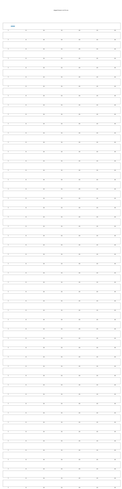

# U3V camera Performance test tool

## Windows

[こちら](https://sensing-dev.github.io/doc/startup-guide/windows/index.html)よりSDKをインストールしてください。

## C++版

レポジトリ内にあるCMakeLists.txtを使ってビルドをしてください。

```
cmake -G "Visual Studio 17 2022" -A x64 ../
cmake --build . --config Release
```


## Python版
以下のモジュールをインストールしてください。

```bash
pip3 install -U pip
pip3 install ion-python
pip3 install gendc-python==0.1.0
```

もしフレームドロップがどこで起きているかをグラフにしたい場合はmatplotlibもインストールする必要があります。
```bash
pip3 install matplotlib
```

## For Linux

[こちら](https://sensing-dev.github.io/doc/next/startup-guide/linux/index.html)よりSDKをインストールし、以下の環境変数を設定してください。

```bash
export LD_LIBRARY_PATH=/opt/sensing-dev/lib:/opt/sensing-dev/lib/x86_64-linux-gnu:$LD_LIBRARY_PATH
export GI_TYPELIB_PATH=/opt/sensing-dev/lib/x86_64-linux-gnu/girepository-1.0:$GI_TYPELIB_PATH
```

## C++版

以下のコマンドでコンパイルが可能です。

```bash
g++ src/test_performance.cpp -o test_performance  \
-I src/ \
-I /opt/sensing-dev/include -I /opt/sensing-dev/include/aravis-0.8 \
-I /opt/sensing-dev/include/opencv4 \
-L /opt/sensing-dev/lib \
-L /opt/sensing-dev/lib/x86_64-linux-gnu \
-lHalide -lion-core -ldl -lpthread -lopencv_core \
-lopencv_imgcodecs -lopencv_highgui -lopencv_imgproc \
-laravis-0.8 -lgobject-2.0 \
`pkg-config --cflags --libs glib-2.0`
```

## Python版

以下のモジュールをインストールしてください。
```bash
pip3 install -U pip
pip3 install ion-python
pip3 install gendc-python==0.1.0
```

もしフレームドロップがどこで起きているかをグラフにしたい場合はmatplotlibもインストールする必要があります。
```bash
pip3 install matplotlib
```

## How to use
以下のpythonプログラムを実行してください。
```
python test_performance.py
```

各引数は以下をご確認ください。
```
$ python src/test_performance.py
usage: test_performance.py [-h] [-d DIRECTORY] [-nd NUMBER_OF_DEVICE] [-nf NUMBER_OF_FRAMES] [-nt NUMBER_OF_TESTS] [-rt] [-re] [-db]

Performance test for your U3V Camera

options:
  -h, --help            show this help message and exit
  -d DIRECTORY, --directory DIRECTORY
                        Directory to save log
  -nd NUMBER_OF_DEVICE, --number-of-device NUMBER_OF_DEVICE
                        The number of devices
  -nf NUMBER_OF_FRAMES, --number-of-frames NUMBER_OF_FRAMES
                        The number of frames to obtain per test
  -nt NUMBER_OF_TESTS, --number-of-tests NUMBER_OF_TESTS
                        The number of tests to perform in this script
  -rt, --realtime-display-mode
                        Image capture in Realtime-display mode.
  -re, --realtime-evaluation-mode
                        Run performance test in Realtime-evaluation.
  -db, --delete-bins    Delete bin files in --realtime-ecaluation-mode.
```

以下のような出力が表示されます。
```bash
$ python src/test_performance.py 
[LOG ion-kit] This is ion-kit with debug-log; internal-develop 231011
[LOG ion-kit] The device is not GenDC supported
[LOG ion-kit] The device is not GenDC supported
log written in <output directory>\U3V-performance-test-YYYY-MM-DD-HH-mm-SS\0\frame_log.txt
0.964516129032258
log written in <output directory>\U3V-performance-test-YYYY-MM-DD-HH-mm-SS\1\frame_log.txt
1.0
log written in <output directory>\U3V-performance-test-YYYY-MM-DD-HH-mm-SS\2\frame_log.txt
1.0
log written in <output directory>\U3V-performance-test-YYYY-MM-DD-HH-mm-SS\3\frame_log.txt
1.0
```
数字はフレーム取得率です。つまり、表示が1.0の時はフレームドロップはありません。


### グラフの作成 

ドロップが起きた箇所を視覚化したい場合はvisualize_frame_log.pyを実行してください。

以下のような出力とともに、stat.pngが保存され、録画中のどのタイミングでフレームドロップが起きたかを青いまるで確認することができます。

```
$ python visualize_frame_log.py <output directory>\U3V-performance-test-YYYY-MM-DD-HH-mm-SS/
total run: 50
[96.47435897435898, 100.0, 100.0, 100.0, 100.0, 100.0, 100.0, 100.0, 100.0, 100.0, 100.0, 100.0, 100.0, 100.0, 100.0, 100.0, 100.0, 100.0, 100.0, 100.0, 100.0, 100.0, 100.0, 100.0, 100.0, 100.0, 100.0, 100.0, 100.0, 100.0, 100.0, 100.0, 100.0, 100.0, 100.0, 100.0, 100.0, 100.0, 100.0, 100.0, 100.0, 100.0, 100.0, 100.0, 100.0, 100.0, 100.0, 100.0, 100.0, 100.0]
image is saved under <output directory>\U3V-performance-test-YYYY-MM-DD-HH-mm-SS/stat0.png
```


